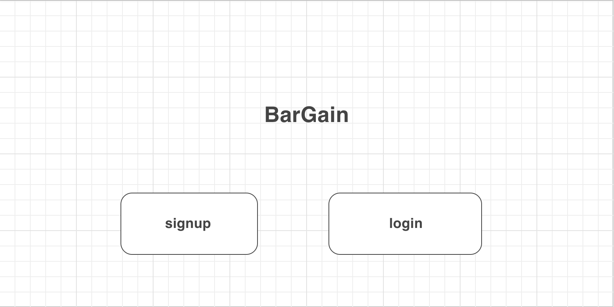
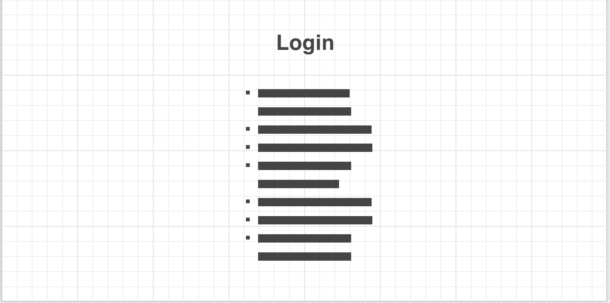
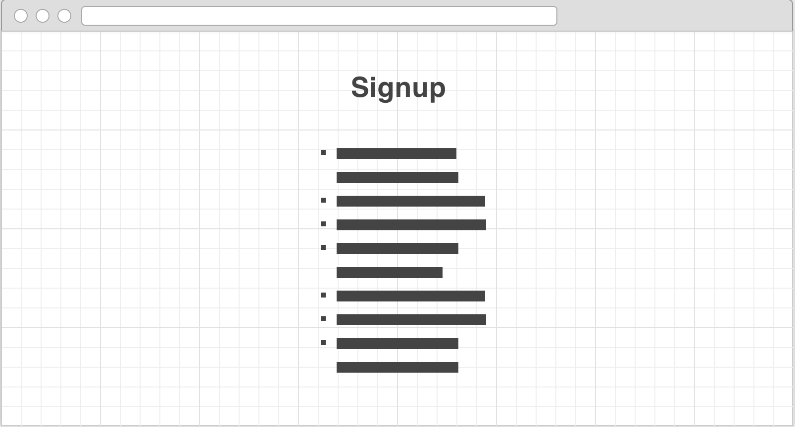
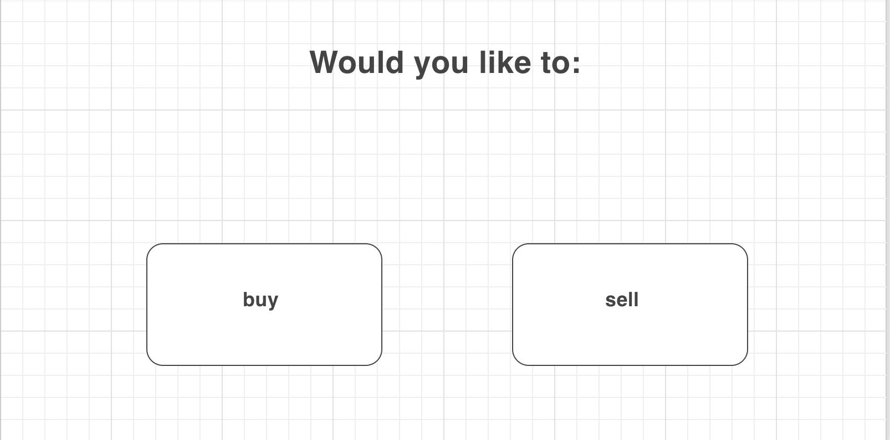
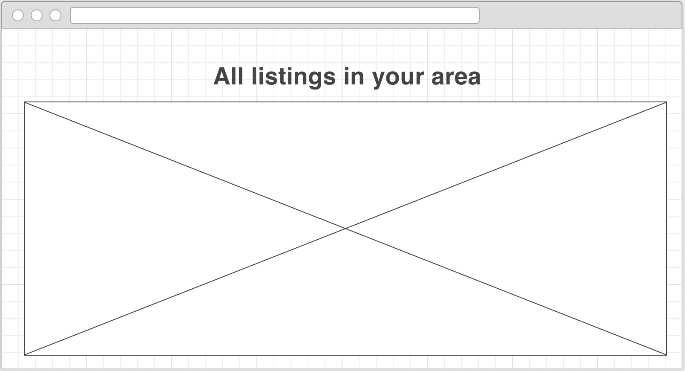
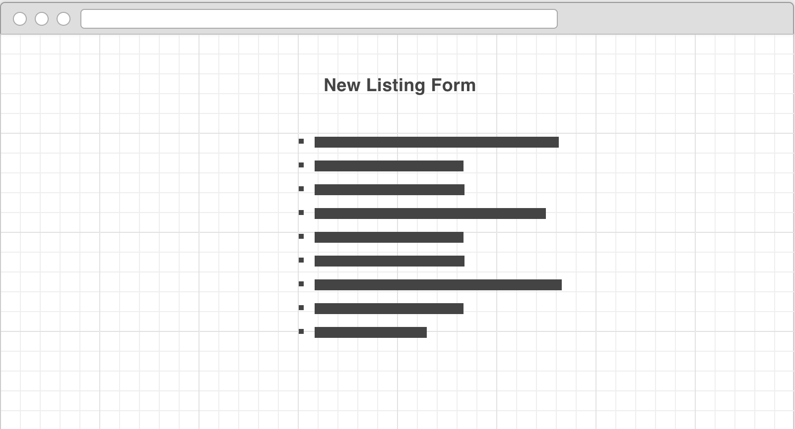
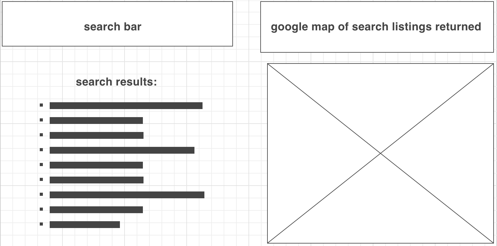

## 'The only bar that doesn't sell alcohol.'
My very first full-stack application. Buy and sell items from thousands of users all geolocated around you. Below is a readme.md file with explanations of the technologies used, the approach taken, installation instructions, unsolved problems, etc. 

## Deployed Link
(https://www.bar-gain.herokuapp.com "BarGain")

### Technologies Used
"eslint": "^3.8.1"  
"bcryptjs": "^2.3.0"  
"body-parser": "^1.15.2"  
"cookie-parser": "^1.4.3"  
"crypto": "0.0.3"  
"dotenv": "^2.0.0"  
"ejs": "^2.5.2"  
"express": "^4.14.0"  
"express-session": "^1.14.1"  
"method-override": "^2.3.6"  
"mongodb": "^2.2.11"  
"morgan": "^1.7.0"  
"node-fetch": "^1.6.3"  
"path": "^0.12.7"

HTML, CSS, Javascript/Jquery, Google Maps API

### Installation Instructions
```bash
npm install
```

### Unsolved Problems/Future Work
Finish CSS styling.
Adjust users' ability to see favorites on their account page.
Add abilities to upload pictures of items.

### Wireframes







